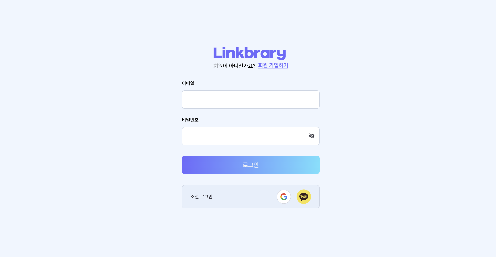
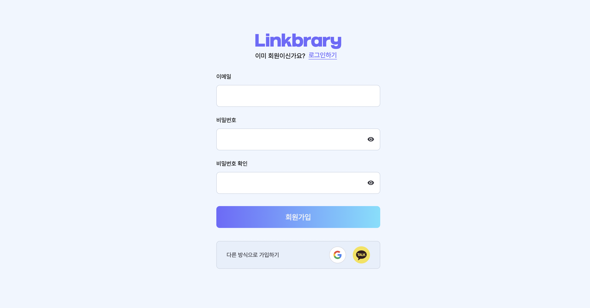
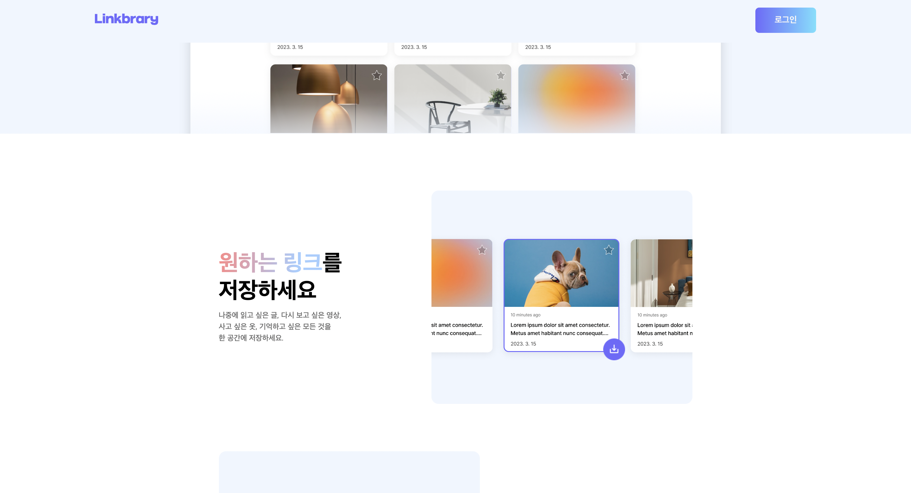

## 요구사항

### 기본

- [x] 2주차 부터는 Github에 PR(Pull Request)을 만들어 주세요. (참고: Github 가이드 문서 링크 필요)
- [x] Netlify에 파일 배포가 아닌 포크한 Github 레포지토리와 연결해 주세요.
- [x] 아래로 스크롤 해도 “Linkbrary” 로고와 “로그인” 버튼이 있는 상단 네비게이션 바(Global Navigation Bar)가 최상단에 고정되게 해주세요.
- [x] 피그마 디자인에 맞게 PC사이즈 로그인 페이지를 만들어 주세요.
- [x] 로그인 페이지의 url path는 ‘/signin’ 입니다.
- [x] 피그마 디자인에 맞게 PC사이즈 회원가입 페이지를 만들어 주세요.
- [x] 회원가입 페이지의 url path는 ‘/signup’ 입니다.
- [x] React와 같은 UI 라이브러리를 사용하지 않고 진행합니다.

### 심화

- [x] palette에 있는 color값들을 css 변수로 등록하고 사용해 주세요.
- [x] 비밀번호 input 요소 위에 비밀번호를 확인할 수 있는 아이콘을 추가해 주세요.

## 주요 변경사항

- 상단 네비게이션 바 최상단에 고정
- 회원가입 페이지 구현
- 로그인 페이지 구현
- css 변수 등록

## 스크린샷

## 멘토에게

- 요소 별로 assets, public 등의 폴더로 관리하라고 하셨는데, 잘 나눈건 지 피드백 부탁드립니다!
- 클래스 중복을 제거하기 위해 신경 썼는데 이 부분에 대해서도 엄격한 피드백 부탁드립니다!
- 셀프 코드 리뷰를 통해 질문 이어가겠습니다.
